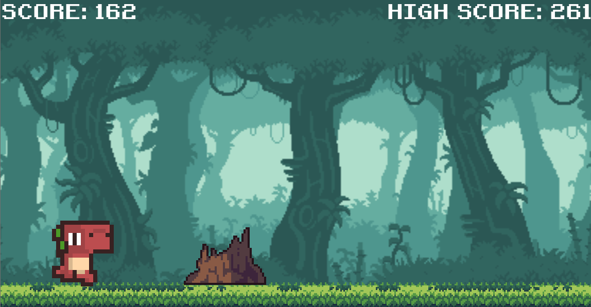

# 🦖 Dinosaur Game - Made with Godot 4.3

A fun and simple clone of the Google Chrome Dinosaur Game, developed using **Godot 4.3** and **GDScript**. 

## 🚀 How to Play 
To run the game, simply execute **dinosaurgame.exe** ! 
All the Godot files are available in the folder **godotproject** !

**Press Space to jump** 🦘

**Press Down Arrow to crouch** ⬇

## ⚙️ Game features 
**🦕 Playable Dinosaur Character :**  
  - Fully animated with smooth **running 🏃‍♂️**, **jumping 🦘**, and **crouching 🛑** actions to dodge obstacles.  
  
**🌄 Dynamic Environment :**  
  - Continuously scrolling **background 🌅** and **ground 🌿**.
  - A variety of obstacles, both static and dynamic (like **birds 🐦** flying at different heights).
  - **Randomized obstacle spawning 🎲** based on the player's score to increase challenge over time. 

**🏆 Score Tracking :**  
  - An **HUD 📊** displaying the current **score 🔢** and the all-time **high score ⭐** to keep track of your progress.

**🎧 Sound design :** 
  - Sound when the dinosaur **jumps 🦘**
  - Sound when the player has **lost ❌**

**⚠️ Collision Detection :**  
  - An **hit detection 💥** to determine when the dinosaur collides with obstacles.
  - A **special animation 💀** when the character is hit by an obstacle

**🔄 Game Over & Restart System :**  

  - Intuitive **game over mechanics ❌** with the option to **restart 🔁** and beat your previous high score.

## 🕹️ Special thanks 
**Special thanks to the YouTube channel "Coding With Russ" for the tutorial ->** https://www.youtube.com/watch?v=nKBhz6oJYsc 

I've made a few improvements to my version compared to the tutorial version

## 📖 Assets used for the game 

Jungle Asset Pack by Jesse Munguia (https://twitter.com/Jsf23Art) -> https://jesse-m.itch.io/jungle-pack

Dino Character Sprites by ScissorMarks (https://twitter.com/ScissorMarks) -> https://arks.itch.io/dino-characters

Free Swamp 2D Tileset Pixel Art by Craftpix (https://craftpix.net) -> https://free-game-assets.itch.io/free-swamp-2d-tileset-pixel-art

Retro Gaming Font by Daymarius -> https://www.dafont.com/retro-gaming.font 

Retro Jump 02.wav by MATRIXXX_ -> https://freesound.org/people/MATRIXXX_/sounds/458641/ 

Game Over High by MT4000 -> https://freesound.org/people/MT4000/sounds/664607/

## 💬 Feedback  
I'd love to hear your thoughts! Feel free to share feedback and suggestions.  

👨‍💻 *By Mathis Huard*  
👤 *My LinkedIn account is right here ->* https://www.linkedin.com/in/mathis-huard/

Enjoy the game and thanks for checking it out! 🎮

## License & Credits

You are free to reuse my work without providing credit to me. However, if you choose to use any of the assets included in this project, **you MUST credit their respective creators.**  

And, please ensure to **CREDIT 'Coding With Russ'** as a courtesy for his valuable guidance.  

Thank you for respecting the work of others !
